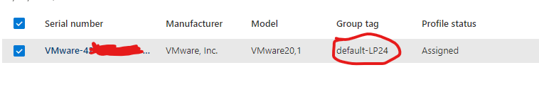
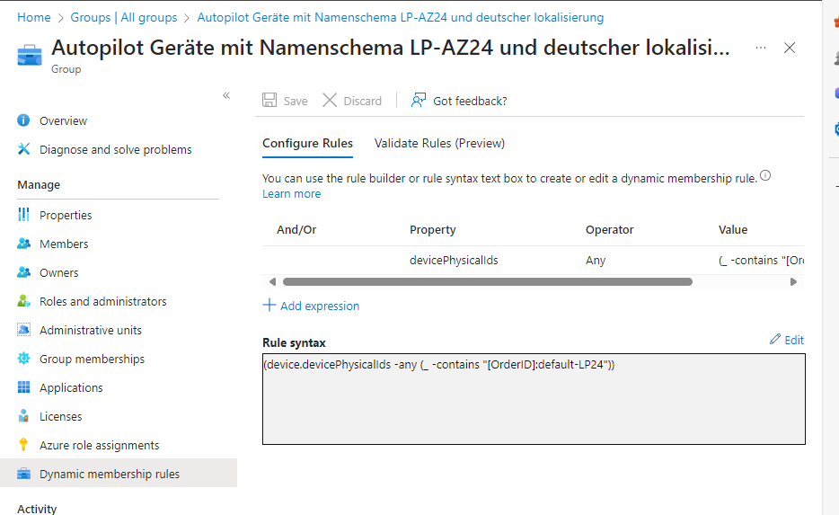
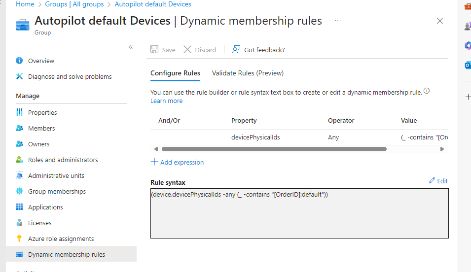

https://learn.microsoft.com/en-us/autopilot/requirements?tabs=configuration

Group Tags are existing

deployment profiles (in my case the full tag "default-LP24" ) and the script (in my case via the first letters of the group tag "default") are linked with the device
Script: 

(device.devicePhysicalIds -any (_ -contains "[OrderID]:default-LP24"))

(device.devicePhysicalIds -any (_ -contains "[OrderID]:default"))
