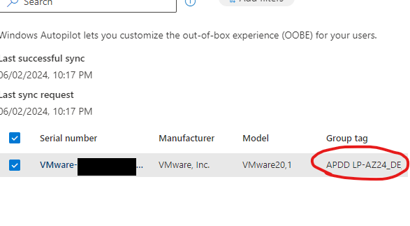

Group Tags are existing

deployment profiles (in my case via Group tag LP-AZ24_DE_) and the script (in my case via Group tag APDD) are linked with the device

(device.devicePhysicalIds -any (_ -contains "[OrderID]:APDD"))

